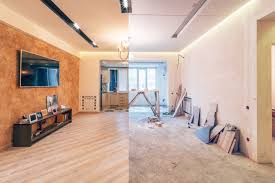
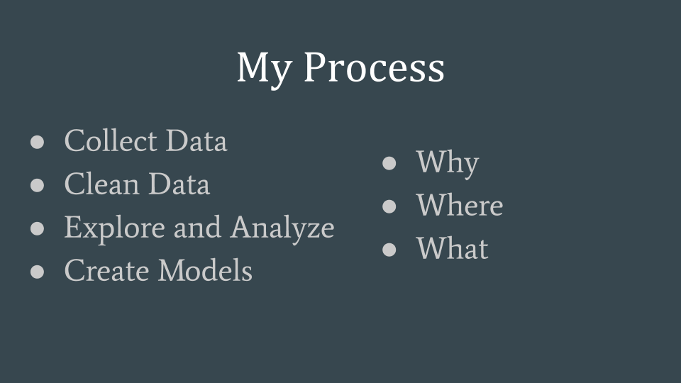
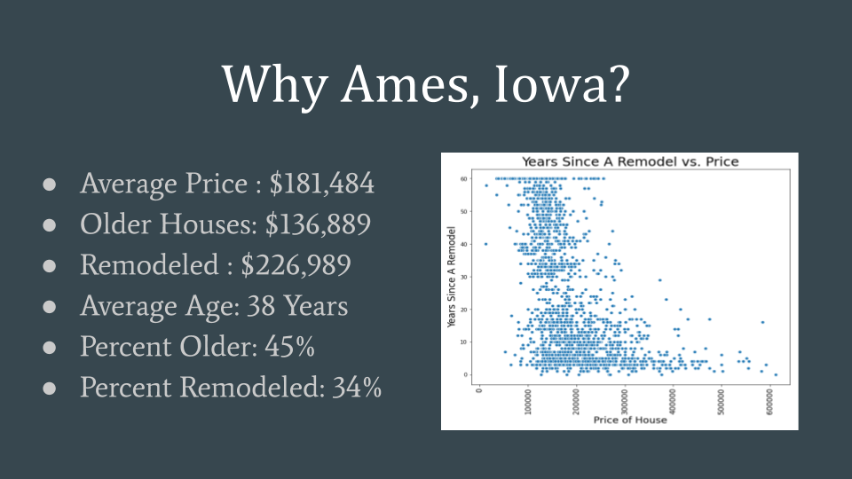
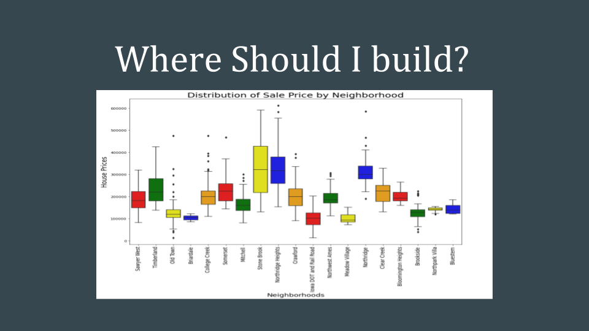
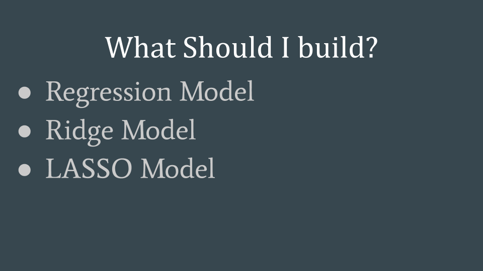

# Project 2 - Predicting Remodeled House Prices for Ames, Iowa
By Uriel Eckmann

## Problem Statement

The year is 2010. The stock market is beginning to recover, but the housing market has completely collapsed. No one is buying houses, and thousands of contractors are scrambling to find work. Luckily for them, Google has annouced that they will be opening their new headquarters right outside Ames, Iowa, so that they could literally be in the heart of the country. This has led to a large influx of people moving to the area hoping to capitalize. Ames has it's fair share of houses that need to be remodeled, or expanded, and it's a golden opportunity for contractors to flip houses quickly and for large profits. The issue is, where should they buy? What should they focus on when renovating these homes? These contractors are all new to the area, and they need help.

## Executive Summary

Our goal here at Data Homes LLC, is to predict what features of houses make them the most desirable, and to predict what refurbished homes will sell for, so contractors can decide which changes will be the most profitable. 
### _Workflow_
#### _Data Cleaning_
We here at Data Homes LLC have collected data from the Ames Assessor's office concerning homes sold from 2006 to 2010. We cleaned that data for our usage, and organized many of the different features of the houses into ordinal rankings in order to interpret them better. The assessors office scaled many of their different household characteristics in ways that were not condusive for our data - so we reinterpreted them to make them more useful for our models. There were also several empty entries that had to be considered, and filled in in the most ideal form for each feature. However, it should be noted that due to the assessors format of filling out features that were missing from homes, much time was devoted to differentiating missing values and missing features. 
#### _Data Exploration_
In the course of going through the data, we discovered the best neighborhoods to build in, what to look for in the surrounding area, which type of houses sell for higher prices, what key features the houses need, and which ones are just unnecessary. 
#### _Observations_
After building several models from our data to predict the house prices, we have determined some rather striking information about what will make the house worth more or less. For example, imitation stucco - very bad idea.

#### _Issues_
We will admit, our models are not perfect. But, if you sign up with us, we can give you much more information than you have now, and every day our models keep improving as we collect more data. It's already great and it's only going to get better, so sign on as client before it's too late!

## Conclusions

The housing market is in difficult times. With the market crash, it really has become a buyers market. Which means that flipping houses now could be more lucrative than ever - buy low, sell high. As the market bounces back, people are going to want better houses, and what those houses need in order to sell at high prices can sometimes not be worth it, or beyond your control. It's important to note that certain neighborhoods could get the short end of the stick in this deal. With lower ranges of prices, it won't be worth it for contractors to flip houses in those neighborhoods as they won't get as good of a return as they would in other neighborhoods. This could potentially lead to further economic disparities between the neighborhoods, which is an important ethical dillema. Simultaneously, some of the coefficients in our model were quite confusing and seemingly counter to what we would have thought, such as central air having a negative coefficient. It leads me to believe that more data is needed and that more models need to be constructed.

## Recommendations

Based on our model, if you want to know what to build and where to build here are some important tips:
1. Every additional square foot above ground in the house increases the house's value by \$48.
1. If you build an entirely new home, that will raise the price by \$17,000
1. Increasing the overall quality of the home by just 1 point raises the house price by nearly \$7,500
1. Increasing the overall condition of the home by just 1 point raises the house price by nearly \$5,000
1. Building a house on a hillside increases the value by \$11,000
1. Building near a positive neighborhood feature can increase the value by as much as \$13,000
1. Roofs: These slight changes can swing the value of the house by tens of thousands of dollars.
    - Don't build Mansard or shed styles
    - Use wooden shingles
1. If you are building a new house, be sure to use a slab, not poured concrete.

__There are so many features to consider, I recommend you hire our services right away so you can learn about them all, so you can save money and sell for more!!!!!__

## References

1. Our [Data Dictionary](http://jse.amstat.org/v19n3/decock/DataDocumentation.txt)
1. The [Kaggle](https://www.kaggle.com/c/dsi-us-12-project-2-regression-challenge?rvi=1) Competition.

## Presentation

